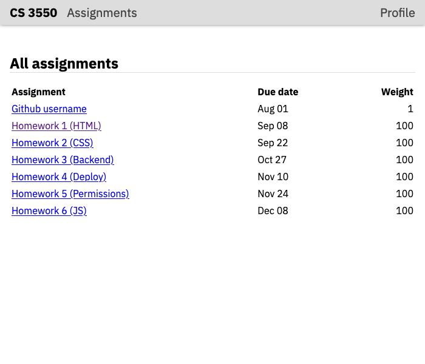
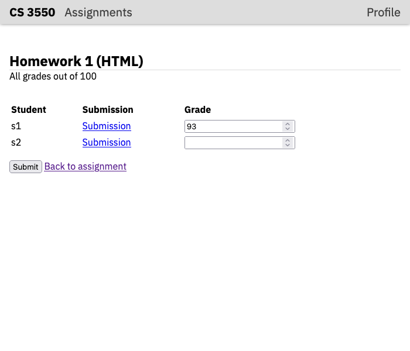
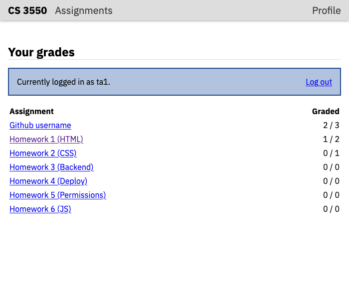

CS 3550 Assignment 1 (HTML)
===========================

**Status**: Final \
**Due**: Phase 1 due **23 Aug**. Phase 2--5 due **30 Aug**.

In this assignment, you will set up a web server and write HTML for
the grading application that you'll build all semester. Specifically,
in this assignment, you will demonstrate that you can:

- Configure and start a basic web server using Django
- Create basic web pages with data/content marked up using HTML
- Use common HTML structural, textual, and media elements
- Use common HTML element attributes for those elements

The assignment is due Friday, 30 August, before midnight. The course's
normal extension policy applies. Hand in your finished assignment by
pushing it to your repository on Github.

This assignment is intended take 6--8 hours and must be done solo. If
you get stuck for more than an hour or so, get help on Piazza or sign
up for an office hours slot.

All code you turn in must be yours. This includes copying code from
sources on the internet, *including the source code of live websites*.
It also includes code generated by AI tools. You may discuss, plan,
and confer with your peers about how to do this assignment, or ask
their help debugging your code. However, any peers you do confer with
must be listed on the assignment cover sheet.

Phase 1: Starting the web server
--------------------------------

First, [install all of the required software](install.md) and make
sure all the indicated commands work.

Second, check out your Github repository. You will do all of your
coding for this class inside this folder. You'll need to accept an
invitation to do this. If you don't have an invitation, contact the
instructors immediately.

Third, run the following set of commands:

    cd <path>
    python3 -m django startproject cs3550 "."

In the first command, replace `<path>` with whatever path is necessary
to get to the Git repository. The second command creates a Django
"project" called `cs3550` and puts it in the current directory.

Fourth, test that this worked by running:

    python3 manage.py runserver

This should print some messages, ending with the line "Quit the server
with CONTROL-C". Open your browser and go to http://localhost:8000/;
you should see a page informing you that "The install worked
successfully! Congratulations!" You can now press `Ctrl+C` in the
terminal to stop the server.

*MacOS users*: In some cases, depending on where you've put these
files, you may see errors from "Watchman". Usually this means you need
to press "yes" some some permissions dialogs that have popped up, but
if the error persists, you can add `--noreload` to the `runserver`
command. This disables Watchman. You'll then need to terminate and
restart the server every time you edit your application.

If at any point in these steps you get what looks like an error
message, ask for help.

Fifth, edit the file `cs3550/settings.py` inside your repository. Find
the line that starts with `STATIC_URL` and add the following line
below it:

    STATICFILES_DIRS = [ 'static/' ]

Create a directory called `static` inside your repository. Your
repository should now contain the following files and folders:

- A folder `cs3550`, which in turn contains `settings.py`, `urls.py`,
  `wsgi.py`, `asgi.py`, and `__init__.py`. It might also contain a
  `__pycache__` directory, which is auto-generated by Python.
- A file `manage.py`, which you use ran above
- An empty folder `static`
- Possibly a file called `db.sqlite3`

Sixth, create the file `.gitignore` in the root of your repository. It
may have been created for you. Add the following contents, or check
that they're already there:

    uploads/*
    db.sqlite3
    *.pyc
    .DS_Store
    autotester
    *~

This makes sure you don't commit any autogenerated files to Github.

Seventh, create a file `test.html` in the `static` directory. Add the
following contents:

    <!doctype html>
    The test worked.

Test that this all worked by running:

    python3 manage.py runserver

Eighth, open your browser and go to http://localhost:8000/static/test.html

You should see the words "The test worked." on your screen. If you do,
commit everything to Github; Phase 1 is done. If you do not, get help.


Phase 2: Writing the page header
--------------------------------

Over the next two phases, we'll be writing the "Assignment" page for
your grading application. In the final version of the application, the
one you'll have at the end of the class, it will look like this:


Of course, that's *not* what the page will look like at the end of
*this* assignment. In fact, since you won't be writing any CSS at all
in this assignment, the page will look plain and unstyled, very
different from the screenshot above. There's purposefully no
screenshot of that unstyled page, because your job in this assignment
is to think about semantics and which element is appropriate, instead
of trying to exactly match a screenshot.

You task is to write valid and semantic HTML that reflects the
*content* of that screenshot, even though it won't copy its
*appearance*. You'll be graded on choosing appropriate HTML tags that
reflect the content's meaning and organization without encoding any
purely stylistic elements.

To start writing the HTML, create the file `index.html` in the
`static` directory. In this file, you can write HTML code, and the web
page defined by that HTML code will show up when you start the server
(by executing the `runserver` command again) and go to
http://localhost:8000/static/index.html in your browser.

Start by setting up a basic HTML page: the doctype, charset
declaration, and `<title>` tag. Set the tab name to "Assignment 1
(HTML) - CS 3550" and set the tab icon to the [application
icon](resources/favicon.ico). You can download that application icon
by clicking the link. Place it in your `static/` folder, and refer to
it as `/static/favicon.ico` from your HTML code. Recall that you do
not typically need to write `<html>`, `<head>`, or `<body>` tags.

Look at the screenshot at the beginning of this section. At the top of
the screenshot, there is a gray bar containing the words "CS 3550",
"Assignments", and "Profile". Write HTML for this navigation bar. Make
"Assignments" link to `index.html` and "Profile" link to
`profile.html`. (This way the links will all work when you add more
pages later.) "CS 3550" does not need to be clickable.

Think through what the semantics are of this gray bar and of each of
the words on it. Choose the appropriate HTML tags carefully; the
[study guide](study-guide.md) lists the tags you are expected to know.
Remember that your HTML will have the contents and meaning, but not
the appearance, from the screenshot. Ask yourself questions like:

- What's the role this navigation bar, and the various pieces of it,
  play on this page? Is it part specific to this page, or to all the
  pages on this site?
- How do different words relate to each other? Are they a paragraph of
  text, or are they list elements, or headings and subheadings?
- Are they interactive? Does clicking on each one take you to a new
  page, or does it perform some action?
- If something were removed from the page, would I understand the web
  page differently (in which case that something is content and should
  be in the HTML) or would it just look different (in which case that
  something is styling and shouldn't be in the HTML).

These, and other questions like it, will help you select the
appropriate HTML tags to use and decide which aspects of the page the
HTML needs to reflect.


Phase 3: The rest of the assignment page
----------------------------------------

Copy your `index.html` file to a new file, `assignment.html`. Close
`index.html` (we'll return to it in Phase 4) and open the new
`assignment.html` page. This file should already contain the page
header, and now we'll add the rest of the assignment page, including
the "Homework 1 (HTML)" title, the blue "action box", the assignment
description, and [the image](screenshots/assignment.png), which like
the favicon you can download into your `static/` directory and refer
to as `/static/assignment.png`.

As you work on this web page, make sure to write valid, well-indented,
and easy-to-read HTML code. Use appropriate structural elements,
including `<header>`, `<nav>`, and `<main>` for the main areas of the
page; `<em>`, `<strong>`, and `<code>` for inline text markup; `<h1>`,
`<h2>`, `<ul>`, `<li>`, and `<p>` tags for text structure; and `<a>`
and `` tags for links and images. Include all required
attributes, such as `href` for `<a>` tags and `src` for `` tags.

You do *not* need to explicitly write the `<html>`, `<head>`, or
`<body>` element, or write closing tags if they are optional. Nor do
you need the closing slash on void elements like ``.

Continue to ask the questions listed in the previous phase to
determine which parts of the page are content and which are style. In
some cases, there may not be any appropriate HTML tag, in which case
you might use `<div>` or `<span>`. But before you do that,
double-check the list of tags in the [study guide](study-guide.md) to
make sure there isn't an appropriate semantic tag.

If you make mistakes, you can use the browser developer tools to
understand how your browser is interpreting your HTML code and why the
page looks the way it does.

Once you're done, look at the page in your browser and make sure it
has the same meaning as the screenshot, even though it looks
different. Once you're satisfied, move on the Phase 4.


Phase 4: Creating more pages
----------------------------

Make three more copies of `index.html`: `submissions.html`,
`profile.html`, and `login.html` pages. Each of these pages---and
`index.html`---now need content. Here are what these four pages should
look like:

|                                                       |                                                       |
|-------------------------------------------------------|-------------------------------------------------------|
|  |  |
| `index.html`| `submissions.html` |
|          |              |
| `profile.html`| `login.html` |

In each case, you're building the "TA view". Later on in the class,
you'll add support for both students and TAs and different users will
then see different content.

Write HTML for each view. Make sure that:

- Each page should use the same HTML for the navigation bar
- Each page should set an appropriate tab title and set the tab icon
- Each table must use proper HTML for tables, including `<table>`,
  `<tr>`, and `<td>` elements. When necessary, tables should use
  `<thead>`, `<tfoot>`, and `<th>` elements to mark header and footer
  rows. Each row in the table should represent the same kind of
  object---don't use tables just to create a 2D layout.
- Input elements should use `<input>` and `<button>` and be placed
  inside a `<form>` element. Note that different browsers display the
  same input elements differently. Think about the *meaning* of the
  input element instead of trying to exactly reflect its *appearance*.
- Make sure all links work. (The "Submission" links on the submissions
  page can go to `#`, which basically makes them not go anywhere.) You
  should be able to click on all of the links and go to another one of
  the pages you have created.

As in Phase 2 and 3, make sure to write valid, well-indented, and
easy-to-read HTML code. Make use of the browser developer tools or an
HTML validator to understand and correct problems.


Phase 5: Improving accessibility
--------------------------------

Let's now make a variety of tweaks to the pages you've developed to
make them more accessible.

**First**, make sure that every input element has a `<label>`. Make
sure the label and input element are linked with `for`/`id`
attributes. Check that clicking on the label puts the cursor into the
associated `input` element.

**Second**, make sure that every input element has the appropriate
`type`. Think about what kind of data the user will be typing in. You
don't need to write `type=text`, since that's the default.

**Third**, let's make the page easier to use from the keyboard. Go to
the "login" page and press the `Tab` key on your computer. This will
move you from one thing on the page to another. Make sure doing this
goes through the fields in the order username, password, login button.

Also, pretty much any time anyone shows up on the login page, they'll
be typing in their username and password, so use the `autofocus`
attribute to make it so the user can immediately type into the
username box when they load the page.

**Fourth**, let's make sure any images on the page have textual
descriptions. Screen-readers can read these descriptions to blind
users.

Add an `alt` attribute to the assignment image. Make sure to describe
the useful contents of that image---basically imagine if there was a
paragraph of text instead of an image, and then write that paragraph.

**Fifth**, let's make sure links have useful content.

Look over all of the links and buttons on all of the pages. Add
`title` attributes where necessary. You don't need `title` attributes
for most links: the "Assignments" link doesn't need a `title` reading
"Go to the Assignments page", because that's already clear from the
content of the link. But if the target of a link or the meaning of an
input element relies on information *outside* that link or input
element, then that information should be in a `<label>` (for `<input>`
elements), `alt` attribute (for `` elements), or `title`
attribute (for all others).

**Finally**, take a look at the "Log out" button on the `profile.html`
page. This link actually performs an action, so give it the `button`
role.


Write a cover sheet
-------------------

Rerun `python3 manage.py runserver` and confirm that every page looks
as expected. Also confirm that all of the links work and that all of
the HTML source code is readable. If you find any problems, use the
browser developer tools or an HTML validator to understand and correct
the problem.

Once you are sure everything works correctly, copy-and-paste the
following text into a new empty text file called "HW1.md" located
directly in your repository (not in the `static/` folder):

```
Homework 1 Cover Sheet
----------------------

In this assignment, I completed:

- [ ] Phase 1
- [ ] Phase 2
- [ ] Phase 3
- [ ] Phase 4
- [ ] Phase 5

I discussed this assignment with:

- ...
- ...
- ...

[ ] I solemnly swear that I wrote every line of code submitted as part
of this assignment (except that auto-generated by Django).

The most interesting thing I learned in this assignment was ...

The hardest thing in this assignment was ...
```

In the first list, replace `[ ]` with `[x]` for each phase of the
assignment you completed.

In the second list, replace the `...`s with the names of all other
persons (student, friend, family, online stranger) that you discussed
this assignment with.

In the oath below that, check the box. Recall that, while you may
discuss the assignment in broad strokes, you must write every line of
code submitted by you, as stated in the oath below this list. This
includes the use of AI tools such as ChatGPT.

In the last two paragraphs, replace the `...` with the most
interesting and the most difficult aspect of this assignment. Don't
just make them a few words; write in full sentences. The instructors
use your answers to make these assignments more interesting and
easier.


How you will use this
---------------------

You typically start writing a web application by writing the HTML, and
it's typical to start with a screenshot produced by, say, a designer.
Then it's the web developer's task to turn that into valid, semantic
HTML. The next step---while we'll do in [Assignment 2](hw2.md)---is to
write CSS code that adjust how each HTML element looks so that your
HTML looks like the screenshots you were working off of.

In a real-world website, much of the HTML is generated
programmatically based on data in a databse. For example, the rows in
the table of assignments would be generated by a `for` loop, where
each iteration of the loop generates one row. You will write this kind
of programmatic HTML generation in HW3.

Writing valid, semantic HTML is important because it helps with
styling, search engine results, and accessibility. For example, `alt`
text helps search engines find pages with relevant images. And it also
helps blind people who use screen readers. (And if that's not you,
now, consider that things may change as you get older.)


Grading Rubric
--------------

This assignment is worth 100 points. The different phases are worth
different weights:

**Phase 1** is worth 5 points. It is graded on:

- Your repository must contain a Django project named `cs3550`
- Your web server must start and respond to requests on `localhost`
- Your web server must successfully show the test page at
  http://localhost:8000/static/test.html
  
If you pass all auto-tests up to and including "Checking that
`/static/test.html` exists", then you have completed this phase.

Note that if you don't complete this phase, it is impossible to grade
most of the others, so you won't receive a passing grade.

**Phase 2** is worth 15 points. It is graded on:

- All of the required content must be present.
- The appropriate structural HTML elements must be used.
- The links should work.
- No unnecessary stylistic elements or content

**Phase 3** is worth 20 points. It is graded on:

- All of the required content must be present.
- The appropriate structural HTML elements must be used for the
  various parts of the page.
- The appropriate textual markup must be used for all of the formatted
  text.
- Complex HTML like lists and headings should be marked up correctly.
- The appropriate HTML attributes must be used where required.
- No HTML should be present for unnecessary stylistic content.

**Phase 4** is worth 40 points. Is is graded on:

- All of the required pages must exist.
- Each page must contain all of the required content.
- Each page must use appropriate HTML elements and attributes.
- Complex HTML like tables and forms must be marked up correctly.
- All links on each page must work and go to the appropriate other page.

**Phase 5** is worth 15 points. It is graded on:

- Each input element must have the appropriate `type` and `<label>`,
  correctly linked.
- Tab order and autofocus must be set correctly.
- All images, links, and input elements must have appropriate
  descriptions.
- The `button` role must be set for the "Log out" link.

**Cover Sheet** is worth 5 points. It is graded on:

- Cover sheet is formatted correctly.
- All questions on the cover sheet have coherent answers.

Note that if your cover sheet does not list all people you discussed
the assignment with, or misrepresents others' work as your own, that
is academic misconduct and can result in severe sanctions beyond the 5
points the cover sheet is worth. In the most severe cases, the
sanction for academic misconduct is failing this course.
